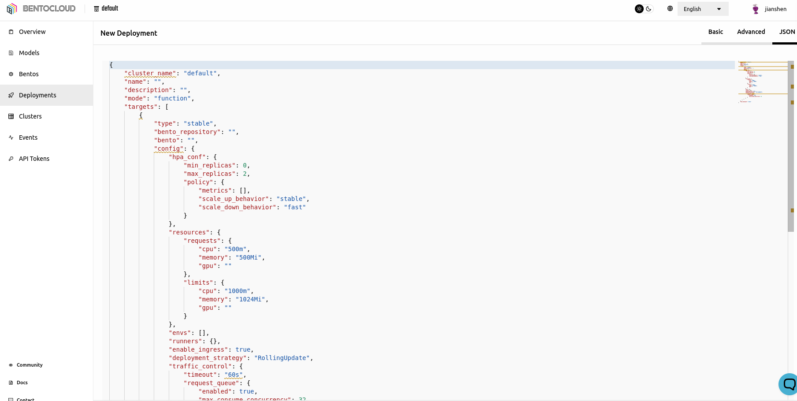
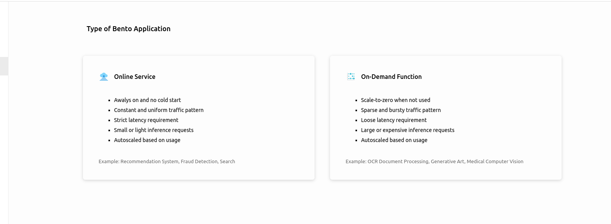
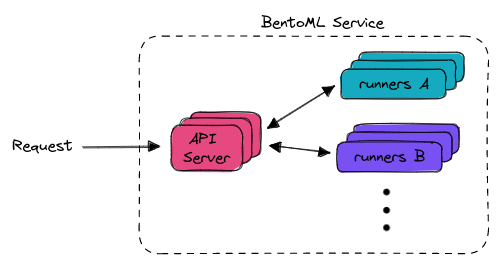
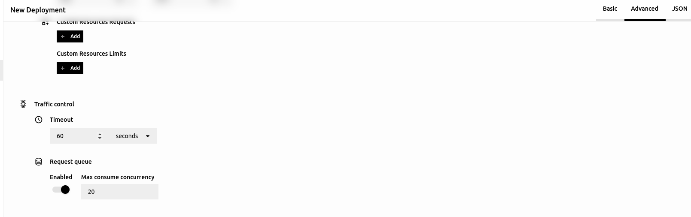

==============
Scale
==============

In the previous parts of our 'Getting Started' series:

- :doc:`Getting Started -- BUILD <build>`
- :doc:`Getting Started -- SHIP <ship>`

We've shown you how to build your application with BentoML and deploy it using BentoCloud. Now, in this final article, we'll explain how BentoCloud makes scaling your application straightforward. BentoCloud is a fully managed platform that aims to relieve users of hardware concerns, allowing you to pay only for what you use.

-------------------
Resource Management
-------------------

~~~~~~~~~~~~~~~~~~~~~~
Auto Scaling Instances
~~~~~~~~~~~~~~~~~~~~~~

BentoCloud is built on the solid foundation of Kubernetes, taking full advantage of the auto-scaling capabilities provided by its `Horizontal Pod Autoscaler <https://kubernetes.io/docs/tasks/run-application/horizontal-pod-autoscale/>`_ (HPA). We've set up a range of metrics that trigger the autoscaler, while also giving expert users the freedom to override these default scaling policies. This can be done via a JSON editor or directly through the BentoCloud API.

For those seeking advanced scaling behaviour, your services can scale according to `custom metrics <https://kubernetes.io/docs/tasks/run-application/horizontal-pod-autoscale/#scaling-on-custom-metrics>`_. This feature is exclusively available to users with a dedicated cluster. Look out for our upcoming guide on how to set this up.

~~~~~~~~~~
Serverless
~~~~~~~~~~

When you deploy a Bento, you can opt for an on-demand function mode of deployment. This is BentoML's serverless approach, ideally suited for use cases where ML models are large, such as high-resolution image models or large language models. Instances can scale down to zero when not in use, offering a cost-effective solution, especially when using pricier GPU instances.

~~~~~~~~~~~~~~~
Traffic Control
~~~~~~~~~~~~~~~

You can adjust timeouts and queue management strategies for each component of a deployment (**Runners** and **API Servers**). The figure below illustrates how a BentoML Service works.

These settings can be found under the `Advanced` tab when creating a new deployment. This flexibility allows teams to align their service to meet business SLOs (Service Level Objectives) and engineering SLAs (Service Level Agreements).

---------------------
Collaborative Scaling
---------------------

Scaling isn't limited to handling larger workloads; it's also about fostering collaboration within and across teams. 
BentoCloud facilitates this process through its **Model and Bento Repositories**. 

These repositories provide a platform for ML practitioners and engineers to **publish**, **share**, and **distribute** their work with ease. You can also **download pre-built models** from popular repositories such as HuggingFace's model hub.

Furthermore, it promotes **reusability** as different teams can leverage the same models for different projects, enhancing efficiency and consistency in model deployment.

----------
Next Steps
----------

Through the **BUILD, SHIP, and SCALE** series, we've showcased the key features of BentoCloud. 

Next up, you can:

- Explore sample projects in :ref:`Bento Gallery <getting-started/build:Bento Gallery 🖼️>`.
- Check out some of our How-Tos
    - :doc:`Manage Models and Bentos </how-tos/manage-models-and-bentos>`
    - :doc:`Deploy Bentos</how-tos/deploy-bentos>`
- Start Building your BentoML application `https://docs.bentoml.org/en/latest/`

