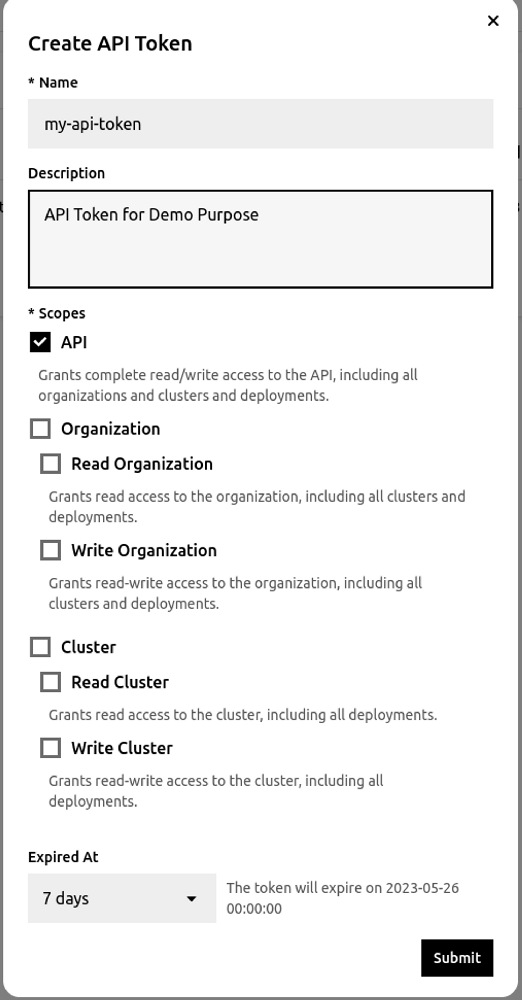
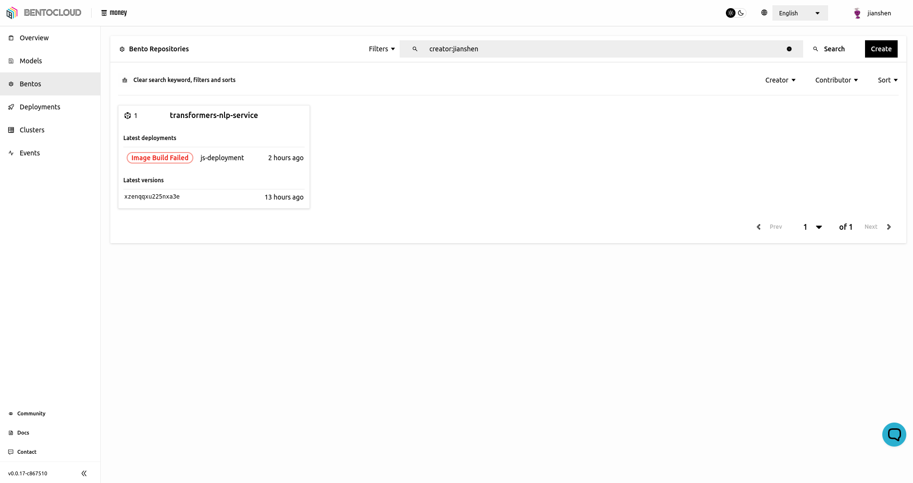
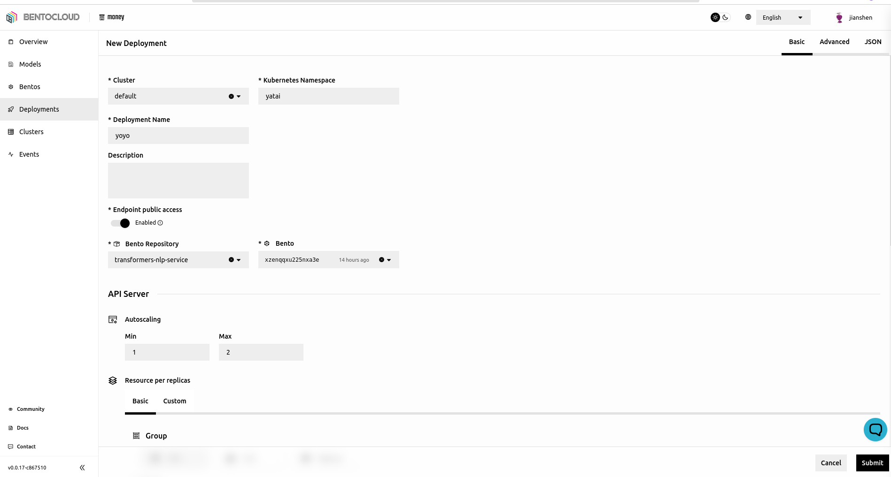
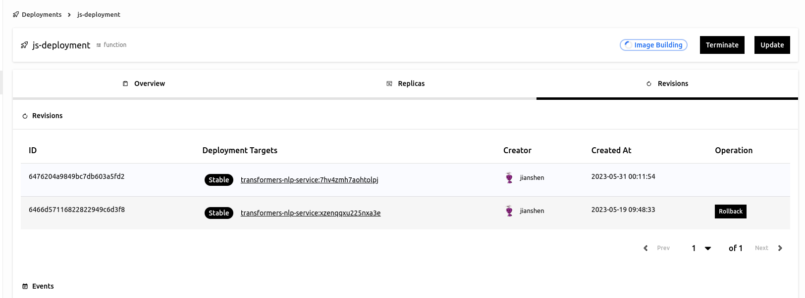

==============
Ship
==============

BentoCloud offers a full suite of MLOps lifecycle management tools right off the bat, enabling developers and ML practitioners to zero in on **BUILDING** while we take care of the intricate infrastructure work - **WE SHIP**.

In this article, we'll delve into how you can:

- **Deploy** your built Bento into production within minutes
- Manage Versioning and Revisions for your Bento and Deployment
- Integrate with popular **MLOps workflow** engines, like Kubeflow and Airflow
- Activate **GPU usage** with a simple click
- Utilize out-of-the-box DevOps and ML **Observability**

-----------------------
Deploying to BentoCloud
-----------------------

Having crafted a Bento as illustrated in the preceding section, :doc:`Getting Started -- BUILD <build>` , we now progress to the next stage: launching it into production using BentoCloud.

.. note:: BentoML offers various deployment alternatives, for more details visit `here <https://docs.bentoml.org/en/latest/concepts/deploy.html>`_.

~~~~~~~~~~~~~~~~~~~
Acquiring API Token
~~~~~~~~~~~~~~~~~~~

To transfer your model from the local store to BentoCloud, you'll first need to secure an API Token. Navigate to `<cloud-url>/api_tokens` and click on `Create`.

Next, log in via the BentoML CLI in your terminal using the following command:

.. code-block:: bash

   bentoml yatai login --api-token chjf2b0n5rgkhrpgnhng --endpoint <https://money.cloud.bentoml.com>

If the login is successful, you should see the following output:

.. code-block:: bash

   Successfully logged in as user "user" in organization "mybentocloud".

~~~~~~~~~~~~~~~~~~
Pushing Your Bento
~~~~~~~~~~~~~~~~~~

After successfully logging in, you're ready to launch your meticulously built Bento into BentoCloud. Run the following command:

.. code-block:: bash

   bentoml push <BENTO_TAG>

In case you've forgotten your Bento's tag, simply run `bentoml list`. You should see an output similar to the following:

.. code-block:: bash

   **Tag                                        Size      Creation Time**
   clip-api-service:z2u7b7h3iwhtolpj          3.70 GiB  2023-05-26 05:48:12
   clip-api-service:shnbulx3hwhtolpj          1.59 GiB  2023-05-26 04:49:47
   transformers-nlp-service:xzenqqxu225nxa3e  1.25 GiB  2023-05-18 01:29:05
   transformer-nlp-service:t4nq34xjxsfx6x33   1.97 GiB  2023-05-03 22:13:08

After successfully pushing your Bento, navigate to `<cloud-url>/bento_repositories` and you'll find your Bento deployed in BentoCloud!

~~~~~~~~~~~~~~~~~~~~
Deploying your Bento
~~~~~~~~~~~~~~~~~~~~

Bento can be deployed in two ways: as an `Online Service` or as a `Serverless Function`. The choice depends on your specific use-case. You can learn more about the implications and best scenarios for each method in our `Deploying Bento <https://www.notion.so/Deploying-Bento-6b38db89b1bf4319adbb6d33a8a30e8f?pvs=21>`_ guide.

Please follow these steps:

1. Choose the appropriate **Cluster**.
2. Select the **Namespace** you want.
3. Give your **deployment** a unique name, for instance, `my-first-deployment`.
4. Enable **Public Access**.
5. Choose the desired **Bento Repository**.
6. Select the correct **Bento Version**.
7. Leave the rest of the settings in their default state.

After setting up, wait for the deployment status to turn green. This indicates your Bento is successfully deployed and ready to serve.

~~~~~~~~~~~~~~~~~~~~~~~~~~~~~~~~
Interacting with Your Deployment
~~~~~~~~~~~~~~~~~~~~~~~~~~~~~~~~

Now it's time to test out your newly deployed service! Visit your `cluster URL` and you'll be greeted with a Swagger UI. This interface lets you conveniently send requests to your deployment for testing. 

Feel free to click `Try it out` with the input sample data. Alternatively, you can send a request directly from your terminal using `cURL`:

.. code-block:: bash

    curl -X 'POST' \
      'http://<your-cluster-url>/summarize' \
      -H 'accept: text/plain' \
      -H 'Content-Type: text/plain' \
      -d 'Your Text Here'

------------------------
Versioning and Revisions
------------------------

Within the dynamic field of Machine Learning, systems typically evolve in two ways:

1. **Code Changes**:
Much like traditional software development, engineers modify the code base, implementing bug fixes, new features, and updates to data processing routines.
2. **Data/Model Changes**:
Without altering any code, Machine Learning practitioners may retrain an existing model with a different dataset. This adjustment can result in the system producing different output behavior.

Both types of changes merit the creation of a newly built Bento. In BentoML, Bentos are **namespaced** with the **name** and **versioned** according to their **tags**, allowing you to track the evolution of your projects over time. You can also assign additional **labels** to each version, providing extra granularity for downstream deployment filtering.

The same principles apply to **Deployments**. You can iteratively create new revisions of your service with various configurations, such as a new Bento Version or different resource settings. If a new deployment exhibits undesired behavior, you have the flexibility to revert back to a previous, stable version at any time.

-------------
Observability
-------------

Machine Learning systems necessitate two types of observability: **DevOps Observability** and **ML Observability**.

~~~~~~~~~~~~~~~~~~~~
DevOps Observability
~~~~~~~~~~~~~~~~~~~~

DevOps Observability encapsulates **metrics**, **logging**, and **tracing**. BentoCloud automatically collects and visualizes all engineering **metrics** related to the deployment within the `Dashboard` tab in the `Deployment` page. Additionally, a **built-in log viewer** lets you examine the logs of your app and its infrastructure. These **logs** can be queried, downloaded, or routed into downstream log processing frameworks for more in-depth analysis. **Tracing** is an ongoing development within BentoCloud and will be supported in future releases.

~~~~~~~~~~~~~~~~
ML Observability
~~~~~~~~~~~~~~~~

As Machine Learning applications continue to proliferate and democratize, a new concept has emerged: ML Observability. This involves tracking the evolution of input data and model quality over time, to identify potential **feature drift** and **model drift**. For a deeper understanding of ML Monitoring, `Bo Jiang's blog post <https://modelserving.com/blog/a-guide-to-ml-monitoring-and-drift-detection>`_ provides a comprehensive guide.

BentoCloud enables you to conveniently configure your ML Monitoring Data for shipment to:

- OLAP databases such as BigQuery, Redshift, Snowflake, and others.
- Third-party Observability Platforms like Arize AI.

For detailed instructions on establishing ML Observability with BentoCloud, refer to our `guide <https://docs.bentoml.org/en/latest/guides/monitoring.html#plugins-and-third-party-monitoring-data-collectors>`_.

----------------------------
Integration with Ops Tooling
----------------------------

Whether it's DevOps, DataOps, or MLOps, they all share a core principle in software engineering. These methodologies focus on unifying software development (Dev) and software operation (Ops), improving collaboration and communication, and automating processes to accelerate software delivery.

BentoML is a Python-first library. This means that it aligns seamlessly with the standard Python CI libraries such as pytest, tox, and unittest, among others.

Orchestration frameworks like Airflow and Kubeflow also integrate smoothly with BentoML. Visit `this page <https://docs.bentoml.org/en/latest/integrations/index.html>`_ to see the full list of frameworks that BentoML supports. Moreover, don't miss this `article <https://www.union.ai/blog-post/unionml-0-2-0-integrates-with-bentoml>`_ written by UnionML, showcasing the delightful integration between BentoML and Flyte!

-----------
Wrapping Up
-----------

This article has guided you through the process of deploying your ML application using BentoCloud. 

Next up, in our :doc:`following article <scale>`, we'll explore how BentoCloud supports the scaling of your application.
